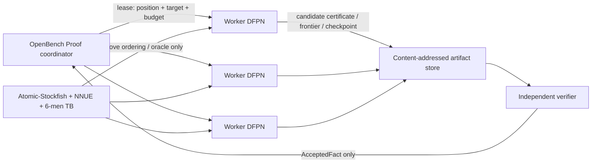

# Hoja de ruta para una resolución débil de Atomic Chess

Estado de investigación: 2026-07-13
Objetivo: demostrar de forma verificable el resultado de la posición inicial de Atomic Chess bajo las reglas exactas de Fairy-Stockfish/Lichess.

Evidencia comunitaria trazable: [ledger de Discord](./discord-evidence-ledger.md).

## Conclusión ejecutiva

Sí, OpenBench puede convertirse en la infraestructura distribuida del proyecto. La unidad de trabajo no debe ser una partida ni un análisis UCI, sino una reclamación binaria sobre un subárbol AND/OR, identificable y reintentable. Cada worker recibiría estado e historial completos, target y presupuesto; ejecutaría DFPN/PNS; y devolvería un checkpoint no fiable, un frente o un certificado candidato. El servidor solo convertiría una reclamación en hecho aceptado después de verificarla fuera de la frontera de confianza del solver.

La arquitectura recomendada tiene cinco piezas separadas:

1. `Atomic-Stockfish` como oráculo de ordenación: NNUE, búsqueda alpha-beta y Syzygy ayudan a escoger primero las líneas prometedoras, pero nunca constituyen la prueba.
2. `AtomicSolver` como descubridor de pruebas: PNS/DFPN inicialmente; PN2 o JL-PNS para coordinar subárboles y PNS-PDFPN como candidato posterior para clústeres homogéneos.
3. `OpenBench Proof` como planificador: mantiene `ProofClaim`, unidades de trabajo, intentos, leases, prioridades, reintentos, checkpoints y artefactos, sin confundir ninguno con un teorema aceptado.
4. Un almacén de DAGs de prueba direccionado por contenido.
5. Un verificador realmente independiente que vuelve a generar todos los movimientos, comprueba terminales y el contrato de tablebases, y no comparte código de reglas, bindings, prober ni hashes Zobrist con Atomic-Stockfish.

La primera meta no debe ser la posición inicial. Debe ser producir y verificar pruebas pequeñas, medir la dificultad real de varios frentes de apertura y decidir con datos si una campaña completa es viable. La escala puede ser de años y de muchos CPU-años; todavía no hay base honesta para dar una cifra más estrecha.



## 1. Qué significa realmente «resolver Atomic»

El objetivo inicial razonable es una **resolución débil**: demostrar el valor de la posición inicial con juego perfecto. La primera campaña no debe mezclar los tres resultados W/D/L, sino fijar el predicado binario `WHITE_CAN_FORCE_WIN`. Su complemento lógico es «blancas no pueden forzar victoria», que incluye tanto tablas como victoria negra; no equivale a «negras ganan». Para ese target, la prueba debe proporcionar:

- En cada nodo del target player, al menos una jugada que conserve el target (nodo OR).
- En cada nodo del oponente, cobertura de **cada** jugada legal (nodo AND).
- En cada hoja, un terminal reglamentario comprobable o una posición cubierta por una tablebase verificada.

Un mate anunciado, una evaluación de `+930`, una PV muy profunda o millones de partidas no son una prueba ni pueden cerrar una hoja. Ubdip hizo exactamente esta distinción: el motor puede ser un oráculo que señale la jugada del bando ganador y reduzca enormemente el problema, pero para una prueba estricta recomendó proof-number search ([Discord 2021: oráculo](https://discord.com/channels/779317816897699850/812407482369441813/818442571582930979), [Discord 2021: PNS](https://discord.com/channels/779317816897699850/812407482369441813/818443628808372225)). También distinguió PNS exhaustivo, alpha-beta casi exhaustivo y un árbol crítico de evaluación alta: solo el primero satisface el objetivo científico ([Discord: tres niveles](https://discord.com/channels/779317816897699850/779317816897699854/985992353372307516)).

Antes de programar el solver hay que congelar en una ADR la semántica exacta:

- Explosiones y condición terminal por desaparición del rey.
- Legalidad de reyes adyacentes y jaque Atomic.
- En passant, promociones y derechos de enroque.
- Regla de 50 movimientos: si la adjudicación es automática o reclamable, por quién y en qué momento.
- Repetición: historial exacto relevante, número de apariciones, política `claimDraw` y precedencia frente a explosión terminal, mate, ahogado e insuficiencia material.
- Atomic960 queda fuera de la prueba de la posición inicial, aunque el verificador puede soportarlo después.

La ADR debe congelar la semántica que ya expone el motor —incluido que `claimDraw` es opcional en la [API del motor](../../../src/api/atomic_outcome.cpp#L68)—, no inferirla de una partida concreta. Para demostrar una victoria blanca, cualquier tabla o ciclo que no esté demostrado como victoria se trata conservadoramente como «no probado». Una prueba de victoria puede ser un DAG sin ciclos; eso simplifica enormemente la verificación.

Para obtener el valor W/D/L completo se ejecutarán dos campañas binarias (`WHITE_CAN_FORCE_WIN` y `BLACK_CAN_FORCE_WIN`) o, más adelante, un protocolo multiresultado formal. Los nodos OR/AND siempre se parametrizan por el jugador objetivo; nunca se reutiliza el complemento de una campaña como si demostrase automáticamente el resultado opuesto.

## 2. Evidencia histórica directamente relevante

Este documento separa tres clases de afirmaciones. El vault de Discord aporta memoria histórica, posiciones y consejos de ingeniería; la literatura aporta algoritmos y precedentes publicados; el diseño de OpenBench Proof es una propuesta del proyecto que aún debe validarse.

| Clase | Qué puede justificar | Qué no puede justificar |
|---|---|---|
| Hecho publicado o artefacto verificable | Cifras de un paper, reglas fijadas, certificado que vuelve a verificar, checksum de un corpus | Extrapolar automáticamente coste o corrección a Atomic |
| Hecho reportado en Discord | Qué se intentó, dónde falló un motor, líneas y artefactos que recuperar | Que una línea esté resuelta, que un score sea ganador o que un algoritmo no documentado sea correcto |
| Propuesta de ingeniería propia | Hipótesis de arquitectura, esquema, scheduler y pilotos | Resultado game-theoretical o escalabilidad antes de medirla |
| Especulación comunitaria | Seeds y prioridades para el censo | Cerrar hojas, omitir defensas o anunciar una solución |

Los JSONL del vault contienen al menos un bloque duplicado internamente en `channel_791247944463417374.jsonl`: mensajes con el mismo ID reaparecen unas 5.300 líneas después. Se deduplicará por message ID y nunca se contará el duplicado como corroboración independiente.

### 2.1 La propuesta de ubdip coincide con OpenBench

En junio de 2024 se discutió literalmente cómo distribuir un intento de resolver Atomic:

- La rama MPI de Stockfish tenía mal rendimiento; para búsqueda profunda, ubdip propuso crear un árbol de profundidad 1–2 y resolver cada subárbol en una máquina ([mensaje](https://discord.com/channels/779317816897699850/812407482369441813/1248179697561370655)).
- Señaló que Antichess se resolvió concentrándose en subárboles y juntando después los resultados ([mensaje](https://discord.com/channels/779317816897699850/812407482369441813/1248180040638922866)).
- Diferenció búsqueda distribuida superficial, difícil e ineficiente, de búsqueda profunda dividida desde arriba, que se distribuye de forma natural ([mensaje](https://discord.com/channels/779317816897699850/812407482369441813/1248232765540008066)).
- Para automatizar una resolución recomendó alpha-beta solo como oráculo y un algoritmo de solver como proof-number search ([mensaje](https://discord.com/channels/779317816897699850/812407482369441813/1248233853378760709)).

Eso favorece tareas gruesas y autónomas sobre la flota heterogénea de OpenBench. No favorece intentar compartir un TT en tiempo real a través de Internet.

En la misma conversación se propuso TDS (Transposition-Table-Driven Work Scheduling) como alternativa ([mensaje](https://discord.com/channels/779317816897699850/812407482369441813/1248234583200108625)). Es una línea seria para un clúster con red rápida, pero no invalida la decisión WAN: TDS envía trabajo al propietario de cada entrada del TT y depende de comunicación asíncrona frecuente, mientras que OpenBench reúne máquinas independientes, de latencia y disponibilidad variables.

Ubdip volvió a delimitar esa separación en 2025: la rama cluster sirve precisamente para paralelizar **una** búsqueda y quizá para intentos de solving, mientras datagen y testing escalan mejor con muchas búsquedas monohilo independientes ([mensaje](https://discord.com/channels/779317816897699850/966610323987660830/1419719405935530146)). Eso conduce a dos backends distintos, no a una elección única: OpenBench WAN reparte claims gruesos; un clúster homogéneo puede recibir uno de los claims difíciles y resolverlo internamente con TDS o PNS-PDFPN.

La evidencia local también respalda un modelo pull: en 2026 se consideró más sensato adaptar un OpenBench moderno y genérico que fishtest antiguo, aunque aquella conversación trataba testing de motores, no proof workloads ([Discord: OpenBench moderno](https://discord.com/channels/779317816897699850/779319972614242354/1462052988838219874)). El worker solicitando trabajo evita asumir conectividad entrante y encaja con máquinas voluntarias; la propuesta concreta de endpoint de prueba sigue siendo ingeniería propia, no una conclusión de Discord.

### 2.2 Antichess: el precedente principal

Mark Watkins demostró que `1.e3` gana en Losing Chess/Antichess mediante una variante de PN2/PNS. Mantenía un árbol superior, lanzaba subbúsquedas PNS acotadas —al final, normalmente `10^8` nodos— y seleccionaba hojas con cierta aleatoriedad, lo que permitía ejecutar muchas expansiones independientes en paralelo. Al final usó habitualmente ocho máquinas de 16 cores. El paper inicial contabilizó 863.301.867 nodos y 66.187.848 referencias de transposición; tras correcciones y simplificaciones, la prueba vigente `rev4` contiene 693.653.102 nodos más 53.819.992 transposiciones, 747.473.094 entradas totales, 5.702 MB sin comprimir, 1,02 GB comprimidos y profundidad máxima 250 ([paper](https://magma.maths.usyd.edu.au/~watkins/LOSING_CHESS/LCsolved.pdf), [proof revisado](https://magma.maths.usyd.edu.au/~watkins/LOSING_CHESS/revision.html)). Un 87% de los nodos internos del defensor en la prueba original tenían una sola jugada legal.

La lección más importante no es el tamaño, sino la independencia. En 2019 se descubrió un bug de doble en passant en tablebases usadas por la prueba; afectaba a varias posiciones y obligó a publicar prueba y código revisados ([historial del proyecto](https://magma.maths.usyd.edu.au/~watkins/LOSING_CHESS/)). Un verificador que comparte movegen y tablebases con el solver reduce costes, pero deja una causa común de error. La búsqueda de descubrimiento fue además mucho mayor que el certificado: aproximadamente 200–300 core-years y `10^16` posiciones PNS. Tamaño de prueba y coste para encontrarla deben medirse por separado.

Atomic presenta una dificultad adicional que impide extrapolar el coste de Antichess: la comunidad señaló que Antichess fuerza a menudo una o muy pocas jugadas, mientras que Atomic conserva muchas alternativas laterales ([discusión](https://discord.com/channels/779317816897699850/812407482369441813/821148061454696498)). Por eso el 87% de nodos defensores con una sola jugada del precedente no debe usarse para estimar Atomic; el branching efectivo se medirá en S5.

### 2.3 Los Alamos Chess: precedente basado en Fairy-Stockfish

La resolución de la segunda partida de Los Alamos Chess es aún más cercana a este proyecto. Roger Sayle usó una versión modificada de Fairy-Stockfish con un comando `proof`, pero trató el motor como oráculo porque el TT Zobrist, las colisiones, carreras y podas de Stockfish no son una base matemática segura. El trabajo se partió en unos 200 subtasks de aproximadamente un día; consumió varios siglos de CPU durante unos 15 meses y produjo un DAG con 267.410.115 posiciones del bando ganador. Una vez construido, el certificado podía verificarse en un portátil en unos 15 minutos ([paper, DOI 10.3233/ICG-240247](https://doi.org/10.3233/ICG-240247)).

El artefacto publicado ocupa aproximadamente 12 GB como texto y 1,5 GB comprimido, y el propio paper advierte que leer o escribir el árbol en SSD es mucho más lento que la búsqueda del motor. La prueba completa está disponible en [figshare, DOI 10.6084/m9.figshare.25424674](https://figshare.com/articles/dataset/game2_d2d3_proof_gz/25424674). Antes de inventar un formato Atomic a gran escala, S1 debe descargar ese artefacto y usarlo como corpus de ingeniería: medir streaming, compresión, chunking, índices, reanudación y verificación reproducible. No valida reglas Atomic, pero sí ejercita la ruta de datos con cientos de millones de posiciones y revela pronto si el object storage o el parser son el cuello de botella.

Esto valida tres decisiones para Atomic:

- Reutilizar Atomic-Stockfish acelera mucho la búsqueda.
- Los subproblemas deben poder componerse y verificarse después.
- El artefacto final debe ser mucho más fiable que el proceso heurístico que lo encontró.

Checkers aporta otro patrón útil: un gestor central mantenía el frente y distribuía millones de búsquedas alpha-beta/DFPN, cerrándolas contra tablebases masivas y ejecutando consistency checks. No es un molde directo —demostrar tablas es distinto de demostrar una victoria—, pero confirma que el manager global debe almacenar resultados exactos de subproblemas y no la TT efímera de cada worker ([Checkers Is Solved](https://webdocs.cs.ualberta.ca/~mmueller/courses/657-Fall2025/readings/2007-checkers.pdf)).

### 2.4 Intentos y teoría Atomic existentes

Hay material útil para priorizar, pero no para declarar líneas resueltas:

- En 2021 se describió `1.Nf3 f6 2.Nc3` como «más o menos resuelta por los teóricos», seguido inmediatamente por «solo falta el árbol de prueba» ([discusión](https://discord.com/channels/779317816897699850/791249497090686987/818228191319556126), [matiz](https://discord.com/channels/779317816897699850/791249497090686987/818228245291860018)). Eso solo cubre una respuesta negra concreta y es una pista histórica, no una conclusión actual.
- Análisis muy grandes de esa rama apuntaban a `...c6` como mejor defensa y `...Nh6` como una defensa bastante más acotada. Tras `...c6` quedaban muchas alternativas blancas plausibles (`e3`, `e4`, `d4`, `Nd4`, `Nd5`), y avanzar la posición revelaba defensas que la búsqueda desde la raíz había podado ([Discord: comparación de defensas](https://discord.com/channels/779317816897699850/812407482369441813/828241989203001385), [Discord: ramificación c6](https://discord.com/channels/779317816897699850/812407482369441813/880354111046942730), [Discord: alternativas](https://discord.com/channels/779317816897699850/812407482369441813/821083552073908245), [Discord: defensas tardías](https://discord.com/channels/779317816897699850/812407482369441813/821084418436628491)). El orden de pilotos será por ello `...Nh6` y luego `...c6`, sin asumir que ninguna esté ganada.
- Dentro de `1.Nf3 f6 2.Nc3 Nh6 3.g4`, el vault conserva un conjunto concreto de defensas para sembrar el censo: `4...e5`, `4...d6`, `5...g6`, `5...Bd6`, `5...Bb4`, y más adelante `6...Bd6`, `7...fxe4`, `7...e5`, `8...h6`, `8...Nd7`, `11...Na6` y `12...Na6` ([primer grupo](https://discord.com/channels/779317816897699850/812407482369441813/828155909749604352), [segundo grupo](https://discord.com/channels/779317816897699850/812407482369441813/828156028532162600)). Son prioridades de expansión, no una whitelist: el mismo hilo insiste en que hasta `1...e5`, aunque se creyese perdida, debe cubrirse exhaustivamente ([mensaje](https://discord.com/channels/779317816897699850/812407482369441813/828155766950068244)).
- `1.Nh3` y varias continuaciones también se consideraron candidatos fuertes, con opiniones contradictorias en el mismo hilo. Deben entrar en el censo, no fijarse por intuición.
- La función objetivo no es «mate más corto» ni «mayor cp», sino la estrategia ganadora más fácil de certificar: ya en 2021 la discusión lo formuló como buscar la vía más segura, no la más rápida ([mensaje](https://discord.com/channels/779317816897699850/812407482369441813/821147959730503680)).
- En 2024, aiorla conservaba más de 100.000 posiciones a profundidad 35 de un intento anterior; el análisis llegó a aproximadamente `+930 cp`, pero no a una prueba ([mensaje](https://discord.com/channels/779317816897699850/1260924156526985307/1260945389259849758)). Su script escogía la posición con menor evaluación del árbol y analizaba una respuesta blanca contra todas las respuestas negras ([método](https://discord.com/channels/779317816897699850/1260924156526985307/1260952273060626462)). Tras meses de ejecución aparecieron posiciones alrededor de `+1000` donde el motor no encontraba progreso, posibles fortalezas y demasiadas sidelines ([pozos](https://discord.com/channels/779317816897699850/1260924156526985307/1260958073351307354), [fortalezas](https://discord.com/channels/779317816897699850/1260924156526985307/1261022480680616037), [sidelines](https://discord.com/channels/779317816897699850/1260924156526985307/1261025565222375474)). Este corpus puede servir para recuperar heurísticas y construir un benchmark de posiciones-pozo.
- Ese método ya se había propuesto públicamente en 2015: escoger una jugada blanca, cubrir todas las negras, profundizar la hoja de menor eval y, si el umbral subía suficiente, intentar llegar a mate/tablebases; el propio autor advertía que el árbol quizá nunca convergería ([Chess Stack Exchange](https://chess.stackexchange.com/questions/9941/how-to-solve-atomic-chess)). El intento de aiorla es por tanto evidencia empírica de esa estrategia ultraweak/repertoire: produjo datos útiles, pero sus pozos confirman que no sustituye PNS ni un contrato de prueba.
- La ruta `Nf3-e3` explorada por aiorla contiene finales especialmente difíciles y Fairy contra Fairy tampoco los convertía de forma fiable ([Discord: endgames difíciles](https://discord.com/channels/779317816897699850/1260924156526985307/1261035971915415735)); no se priorizará sobre `...Nh6` por su score histórico.
- Una defensa atípica `...Kg1` no apareció a tiempo ni a profundidad 41 y casi dos mil millones de nodos; perft confirmó que era legal. Ubdip dejó como causas posibles pseudo-legalidad, poda o evaluación a largo plazo ([caso](https://discord.com/channels/779317816897699850/812407482369441813/1259607759968796764), [diagnóstico](https://discord.com/channels/779317816897699850/812407482369441813/1259620577098993665)). Es un fixture ideal para demostrar que el oracle nunca autoriza omitir movimientos legales.

Hay una corrección importante para cualquier piloto reducido. El `6x6atom` histórico no es Atomic Lichess/Fairy sobre un tablero menor: la configuración finalmente usada heredaba de `nocheckatomic`, activaba `extinctionPseudoRoyal` y eliminaba el doble paso ([configuración del hilo](https://discord.com/channels/779317816897699850/791247944463417374/816738779313733694)); el descriptor de Fairyground lo llama explícitamente «No Check Atomic Chess 6×6» y Fairy-Stockfish aún lo declara como `[6x6atom:nocheckatomic]` ([variants.ini](https://github.com/fairy-stockfish/Fairy-Stockfish/blob/fb78cb561aa01708338e35b3dc3b65a42149a3c4/src/variants.ini#L712)). El primer borrador del chat sí heredaba temporalmente de `atomic` ([mensaje](https://discord.com/channels/779317816897699850/791247944463417374/816735608231821352)), lo que explica la confusión. Este juego puede probar mecánica de scheduler en una campaña y schema separados, pero **cero resultados, fixtures o redes 6×6 cuentan como evidencia sobre Atomic 8×8 normativo**.

También debe existir un build de oracle específico para solving. En 2024 ubdip recordó que forks de mate/studies solían retirar podas problemáticas como null-move pruning ([mensaje](https://discord.com/channels/779317816897699850/779319972614242354/1232073153480622211)); en 2021 se sugirió además comparar una evaluación barata y una búsqueda más depth-first contra Fairy completo ([mensaje](https://discord.com/channels/779317816897699850/812407482369441813/828157064018395177)). No se adopta por intuición: S2 medirá al menos `NNUE/full-search`, `NNUE/safe-pruning`, `cheap-eval/safe-pruning` y ordenación sin evaluación. La métrica es tiempo, RAM y nodos exactos hasta un certificado verificado, no Elo ni NPS bruto.

La rama de aiorla debe recuperarse como arqueología de datos: solicitar script, árbol y logs; archivar por checksum y procedencia `top100_2200_atomic_11plies.pgn`, `top300_2100_atomic_14plies.pgn`, `atomic.epd`, los libros `477_lichess_atomic_startpos_cp_400.pgn` y `666_lichess_atomic_startpos_cp_400.pgn`, `acb.bin`, `atomic960_depth30_.pdf`, [Variant960](https://github.com/ijhchess/Variant960) y los estudios [zxoSReNG](https://lichess.org/study/zxoSReNG) y [Jl6LouVQ](https://lichess.org/study/Jl6LouVQ). Son seeds, benchmarks u ordenación, nunca certificados. Los adjuntos no están en el vault: solo quedan metadatos y hay que recuperarlos de sus autores. `atomiktest.epd` tampoco puede usarse como frontera: su generación perft admitía mates absurdos por el filtrado de cp y omitía líneas importantes de `Nf3/Nh3` ([Discord: limitaciones de atomiktest](https://discord.com/channels/779317816897699850/779317816897699854/1398851298438414448)).

Registro inicial de recuperación, que S0 convertirá en un manifiesto machine-readable:

| Artefacto | Evidencia y estado | Uso permitido |
|---|---|---|
| Script, árbol de >100k posiciones y logs de aiorla | El método se describe en el hilo, pero esos tres ficheros no aparecen adjuntos; solicitar a aiorla ([método](https://discord.com/channels/779317816897699850/1260924156526985307/1260952273060626462)) | Corpus de pozos, comparación de heurísticas y reconstrucción histórica |
| `top100...pgn`, `top300...pgn` | Metadatos y tamaños 21.410/67.521 bytes en el vault ([adjuntos](https://discord.com/channels/779317816897699850/1260924156526985307/1414231825374511215)); blobs por recuperar | Seeds y benchmark de aperturas |
| `atomic.epd`, libros 477/666 y `acb.bin` | Metadatos y tamaños en el vault ([adjuntos](https://discord.com/channels/779317816897699850/1260924156526985307/1414448796783607830)); recuperar y hashear cada blob | Ordenación/censo, jamás cobertura de movimientos |
| `atomic.epd` local del match runner | 394.785 bytes, SHA-256 `28ED51C2F42E723D5E127D2D3F21C0BFA4A9B318615AFDB299B93EA62DEA2B1E`; no coincide por tamaño con el adjunto de 22.099 bytes | Mantener como corpus distinto con procedencia propia |
| `Atomic_Rating16.pgn` local | 1.793.098 bytes y SHA-256 `C9C60808C83528411C446E55F5C8228C55DE85DB411F4D95E364245D2ECB1D1D`; coincide en tamaño con [el adjunto histórico](https://discord.com/channels/779317816897699850/791249497090686987/882882082248986665) y existen tres copias byte-idénticas | Corpus histórico de aperturas/partidas, no proof data |
| `6x6atom_run1_e15_l0.nnue` local | SHA-256 `8A326F2FBA0310B945E1940A577F9E87074D427790F7986767B87E144D45F16B`; pertenece a `nocheckatomic` 6×6 | Solo benchmark no normativo y campaña separada |
| Prueba Los Alamos y proofs/source de Antichess | Públicos y versionados en [figshare](https://figshare.com/articles/dataset/game2_d2d3_proof_gz/25424674) y el [proyecto de Watkins](https://magma.maths.usyd.edu.au/~watkins/LOSING_CHESS/) | Corpus de formatos, verificación y corrupción adversarial |

Las fortalezas son un riesgo medido, no teórico. En Discord se reportaron posiciones Atomic evaluadas entre `+2` y `+7` que eran tablas por pawnitization, perpetuos o simetría; la escala HCE/NNUE es arbitraria. Se incorporarán como regresión estas FEN:

```text
8/1p3k2/p7/7p/1P4pP/P5P1/3B1p2/5R1K w - - 0 1
8/5k2/p5p1/1p5p/7P/BP4P1/P4p2/5R1K b - - 0 28
2r1B3/r1P5/8/3pp1pp/1B1PP1PP/8/7K/2N2bkR w - - 19
8/5k2/pr6/4R3/P5P1/4K3/1P6/8 w - - 1 1
```

Las cuatro proceden del vault ([pawnitization 1](https://discord.com/channels/779317816897699850/812407482369441813/821102431571148821), [pawnitization 2](https://discord.com/channels/779317816897699850/812407482369441813/821112401410654270), [posición difícil de aiorla](https://discord.com/channels/779317816897699850/1260924156526985307/1261038217612759122), [regresión NNUE/tablebase](https://discord.com/channels/779317816897699850/812407482369441813/1076262003099828325)). Ninguna evaluación, profundidad, PV ni mate anunciado modifica su estatus exacto.

Como precedente negativo, un intento de «resolver» atomic-crazyhouse usó el motor como oráculo, no implementó completamente las reglas en el código de comprobación y dependió de revisión manual. Ubdip lo describió primero como «básicamente resuelto» ([mensaje](https://discord.com/channels/779317816897699850/779317816897699854/782349069372096582)), pero explicó por qué deliberadamente no lo incluyó en la wiki de juegos resueltos: código experimental que no reflejaba todas las reglas y double-check humano, aunque nadie hubiese encontrado un fallo ([matiz decisivo](https://discord.com/channels/779317816897699850/779317816897699854/782352310314860544)). Debe documentarse como ejemplo de por qué no se puede llamar solved a un análisis no verificable.

El vault obliga además a congelar reglas mediante fixtures, no por memoria comunitaria:

- ICC y Lichess no han compartido siempre exactamente la misma semántica Atomic ([Discord: divergencia de reglas](https://discord.com/channels/779317816897699850/779319972614242354/792903316614545438)).
- Una rama histórica que no modelaba jaque admitía jugadas, enroques y ahogados incorrectos ([Discord: rama sin jaque](https://discord.com/channels/779317816897699850/779319972614242354/799645341489430568)).
- Reyes adyacentes y amenazas de explosión no equivalen automáticamente a jaque directo, y una FEN parseable no tiene por qué ser legal ni alcanzable ([Discord: reyes adyacentes](https://discord.com/channels/779317816897699850/779319972614242354/1092084211797721108), [Discord: FEN alcanzable](https://discord.com/channels/779317816897699850/779317816897699854/790904512407011348)).
- Explosión de torre/castling Zobrist, en passant, movegen/perft y enroque Atomic960 en jaque tienen bugs históricos documentados; todos pasan a S0/S1 como regresiones, no como curiosidades.

### 2.5 Qué aporta —y qué no aporta— Discord

El vault respalda PNS, TDS y el reparto/ensamblado de subárboles; también documenta fortresses, recursos disponibles y errores reales. En 2021 llegaron a ofrecerse cinco servidores Xeon de 24 vCPU, uno por línea, prueba de que hay voluntad comunitaria de aportar cómputo ([Discord: servidores](https://discord.com/channels/779317816897699850/791249497090686987/818230283455168523)). Otras conversaciones de datagen advierten que muchas VM cloud pequeñas rinden poco por core y pueden duplicar trabajo, mientras bare metal suele ser mejor; se medirá por telemetría y no se excluirá hardware por intuición.

No aparece discusión local sustantiva sobre DFPN, PN2, JL-PNS, GHI, diseño de certificados, verificación independiente formal ni OpenBench como granja de teoremas. Esas partes proceden de literatura citada o son ingeniería propuesta en este documento. Que Discord recomendase OpenBench para testing convencional no demuestra que su modelo `GAMES` sirva para solving; de ahí el workload `PROOF` separado.

Fairy-Stockfish distingue expresamente entre «resolver de forma práctica» y una prueba game-theoretical en su [wiki de juegos resueltos](https://github.com/fairy-stockfish/Fairy-Stockfish/wiki/Solved-games). Mantendremos la misma disciplina terminológica.

Ubdip resumió además el estándar científico: colisiones de hash y otros atajos hacen que los resultados prácticos sean indicios fuertes, mientras que el árbol de Antichess es el ejemplo de cómo respaldar una afirmación extraordinaria ([mensaje](https://discord.com/channels/779317816897699850/793813826436464640/867659752875491388)).

## 3. Algoritmo recomendado

| Enfoque | Papel recomendado | Ventaja | Límite |
|---|---|---|---|
| Alpha-beta/Stockfish | Oráculo y generador rápido de candidatos | Ya existe, NNUE muy fuerte, excelente ordenación | TT, podas y score no constituyen prueba |
| PNS clásico | Prototipo y corpus pequeño | Semántica AND/OR natural | Memoria elevada |
| DFPN | Solver local inicial | Mucho menor consumo de memoria; checkpoints naturales | Paralelización y transposiciones requieren cuidado |
| PN2 / árbol superior + PNS | Coordinación de frentes | Precedente de Antichess; tareas independientes | Afinar prioridades puede requerir datos y algo de intervención |
| JL-PNS | Árbol superior persistente con jobs locales | El paper reporta 8,58× de speedup medio en 16 cores sobre problemas de Connect6 | Resultado de otro juego/hardware; primero debe compararse en Atomic |
| PNS-PDFPN | Backend de clúster posterior | Dos niveles de paralelismo; el paper reporta 208,6× en 1024 cores sin conocimiento de dominio y 332,9× con heurística | Cifras de Sprouts de 47 puntos y de un clúster homogéneo/baseline concretos; no son una predicción para Atomic ni para Internet |
| Dovetailing DFPN | Diversificación entre workers WAN | Casi sin comunicación; semillas distintas pueden hallar líneas difíciles | Duplica trabajo y comparte poca información |
| TDS / TT distribuido | Investigación para un clúster dedicado | Muy buen escalado con red rápida y mensajes asíncronos | Demasiada granularidad y dependencia de red para workers voluntarios |
| Threat-sequence / mate subsolver | Generador exacto de subproofs tácticos | Las amenazas de explosión/jaque pueden reducir drásticamente respuestas y tamaño de certificado | La variante heurística que ignora defensas es incompleta; cada respuesta legal debe regenerarse y verificarse |
| QBF bounded-depth | Backend independiente para «force win/mate en ≤N ply» | Los cuantificadores modelan la alternancia y permiten extraer/validar estrategia; útil como cross-check formal | El encoding crece con N, el encoder puede tener bugs y no resuelve por sí solo horizonte desconocido, repetición ni `startpos` |
| Retrograde/tablebases | Terminal exacto y poda de endgames | Resultado perfecto en el dominio cubierto | Cobertura limitada y necesidad de verificar reglas/TB |
| MOPNS | Backend multiresultado experimental | Busca W/D/L en un árbol común; en los experimentos publicados creó menos nodos que PNS acumulado | En esos mismos experimentos no fue más rápido; complica certificados y GHI, así que no sustituye al target binario v1 |

Referencias primarias: [Parallel DFPN y dovetailing](https://ojs.aaai.org/index.php/AAAI/article/view/7551), [TDS](https://webdocs.cs.ualberta.ca/~jonathan/publications/parrallel_computing_publications/tt.pdf), [JL-PNS](https://ir.lib.nycu.edu.tw/bitstream/11536/21399/1/000316479500004.pdf), [PNS-PDFPN](https://ojs.aaai.org/index.php/AAAI/article/download/41010/44971), [MOPNS](https://www.lamsade.dauphine.fr/~cazenave/papers/mopns.pdf), la taxonomía de [threat-sequence search](https://www.cs.cmu.edu/~mheule/publications/solving_games.pdf) y [QBF para estrategias acotadas en juegos de tablero](https://arxiv.org/abs/2303.16949).

### Decisión

1. Implementar PNS de referencia y DFPN determinista monomáquina.
2. Comparar DFPN, DFPN `1+epsilon`, PN2 y PDS-PN sobre un corpus Atomic común antes de congelar el backend.
3. Encima, comparar PN2 y JL-PNS como árbol superior persistente que cree subjobs gruesos.
4. Para OpenBench público, asignar subjobs independientes de varios minutos u horas; añadir dovetailing controlado cuando interese explorar el mismo nodo con políticas distintas.
5. Evaluar PNS-PDFPN para un grupo de máquinas estables o un clúster, no como requisito de la primera granja voluntaria.
6. Mantener MOPNS como experimento posterior para W/D/L: compararlo solo cuando las campañas binarias y sus certificados sean correctos, porque menos nodos no implicó menos wall time en el paper.
7. Benchmarkear el oracle de solving como parte del algoritmo: NNUE y podas completas, podas conservadoras, evaluación barata y ordenación puramente estructural sobre los mismos claims. Gana la configuración que minimiza coste hasta `AcceptedFact`, no la de mayor Elo.
8. Añadir un subsolver táctico exacto para explosión/mate solo después del verificador. Puede proponer un macro-certificado, pero el verifier expande cada nodo universal y todas las defensas; threat-space heurístico solo ordena y lambda search no se presume aplicable en un juego con zugzwang y sin pass.
9. Prototipar QBF solo sobre roots pequeñas y horizonte explícito. La estrategia extraída se traduce al certificate Atomic y ambos verificadores deben concordar; si el QBF solo responde true/false sin estrategia validable, no crea un fact.

La revisión [Game-Tree Search Using Proof Numbers](https://webdocs.cs.ualberta.ca/~mmueller/ps/ICGA2012PNS.pdf) será la referencia de implementación para AND/OR, DFPN, memoria, Graph History Interaction y paralelización; para GHI se añadirá el tratamiento formal de Kishimoto y Müller ([paper](https://webdocs.cs.ualberta.ca/~mmueller/ps/kishimoto-mueller-infsci-ghi.pdf)). NNUE puede inicializar prioridades o desempatar, pero `pn=0`/`dn=0` solo nace de terminales o hechos ya demostrados.

## 4. Contrato de prueba

### 4.1 Estado canónico

La versión 1 usará **solo SHA-256**. Elegir un algoritmo único evita que dos implementaciones produzcan namespaces incompatibles. Toda codificación fija endianness, anchos, orden de campos y movimientos, longitudes antes de arrays y separadores de dominio distintos para `state`, `history`, `claim`, `node`, `chunk` y `artifact`; por ejemplo `atomic-proof-v1/state\0`. El identificador no puede ser el Zobrist de 64 bits.

El estado canónico debe contener como mínimo:

- Las 64 casillas y lado al turno.
- Derechos y orígenes de enroque.
- Casilla en passant.
- Contador de 50 movimientos.
- La política de adjudicación fijada por la campaña.
- Versión exacta de reglas y esquema.

Dos tableros visualmente idénticos no siempre son el mismo estado de juego si su historial cambia la repetición o sus contadores.

El historial v1 será implementable y conservador: una secuencia ordenada y length-prefixed de las claves canónicas de repetición desde el último límite de no-retorno formalmente demostrado hasta la posición actual, más los conteos derivados y el índice actual. Se serializa el sufijo exacto, no solo un contador ni el hash acumulado. Dos claims solo comparten nodo si estado, secuencia y política `claimDraw` coinciden byte a byte.

Esto es Graph History Interaction: el valor de un nodo en un grafo cíclico puede depender del camino ([Kishimoto y Müller](https://webdocs.cs.ualberta.ca/~mmueller/ps/kishimoto-mueller-infsci-ghi.pdf)). La v1 no fusionará historiales distintos. Solo se recortará el prefijo cuando exista una prueba formal de que ningún estado anterior puede volver a alcanzarse; llamar «irreversible» a una jugada o ver que se reinicia rule50 no basta. Optimizar la fusión vendrá después de demostrar corrección.

La ADR debe fijar con tests de precedencia cuándo se ofrece y quién puede ejercer `claimDraw`, y qué gana si en el mismo estado concurren explosión del rey, mate, ahogado, insuficiencia, rule50 o repetición. El solver no puede decidir esta precedencia a partir del score del motor.

Identidades inmutables:

```text
state_id   = SHA256(domain_state   || canonical_state)
history_id = SHA256(domain_history || canonical_history)
claim_id   = SHA256(domain_claim   || rules || adjudication || state_id || history_id || target)
profile_id = SHA256(domain_profile || verifier_policy || TB_manifest || TB_trust_mode)
artifact_id= SHA256(domain_artifact|| artifact_type || canonical_artifact_bytes)
```

La red NNUE, seed y commit del solver describen **cómo se busca** y pertenecen a la unidad de trabajo; no cambian el teorema. Las reglas, adjudicación, target e historial sí forman parte del claim. En cambio, un checksum concreto de tablebases describe la dependencia y frontera de confianza de una prueba, no el valor semántico de la posición. Por eso queda en `profile_id` y en el manifiesto del certificado: dos TB distintas pueden aportar pruebas del mismo `claim_id`, pero un fact condicional a un perfil no se reutiliza como fact incondicional. `fact_id` enlaza claim, resultado, certificado y perfil; una verificación TB-free puede promover el mismo claim a un perfil de confianza más fuerte sin duplicar todo el grafo de claims.

### 4.2 Nodo del certificado

La cobertura depende del resultado reclamado, no solo de quién mueve:

- Para `PROVED_TARGET`, un nodo con el jugador objetivo al turno es existencial/OR y guarda una jugada que conserva el target; con el oponente al turno es universal/AND y enumera **todas** las jugadas legales.
- Para `PROVED_COMPLEMENT`, el dual local cambia los operadores: con el jugador objetivo al turno es universal/AND y refuta **todas** sus jugadas; con el oponente al turno es existencial/OR y guarda al menos una respuesta que conserva el complemento. Los nombres de nodo se derivan de `result + side_to_move`, no quedan fijados solo por el color.
- Cada lista exhaustiva está canónicamente ordenada y el verificador la compara con su movegen completo; una lista existencial contiene una jugada legal y su hijo demostrado.
- Hoja terminal: razón exacta y resultado.
- Hoja TB: posición e historial, resultado reclamado, cardinalidad, familia, manifest/checksum y evidencia de que satisface `tb_leaf_applicability`.
- Transposición: referencia por hash criptográfico a otro nodo cuyo estado serializado coincide byte a byte.

En certificados de alcanzabilidad, los chunks forman un DAG direccionado por contenido. Un `SafetyCertificate` no puede hashear recursivamente cada nodo de un ciclo: serializa cada SCC de forma canónica con índices locales, hashea el SCC completo y hace que las dependencias entre chunks sigan el DAG de condensación. Un manifiesto raíz fija claim, profile, reglas, schema y hashes de todos los chunks. Registra también commits de descubrimiento/verificación y red NNUE como procedencia, sin convertirlos en identidad del teorema. El certificado nunca necesita guardar scores NNUE como verdad.

El dual local no resuelve por sí solo los ciclos. `PROVED_TARGET` es una prueba de alcanzabilidad: toda referencia debe formar un DAG o llevar un rango bien fundado que decrezca estrictamente hasta un terminal/TB. Para `PROVED_COMPLEMENT`, una prueba finita que termina explícitamente en derrota/tablas del target puede usar el mismo formato dual. Una fortaleza o estrategia de repetición cíclica, sin embargo, es una prueba **coinductiva de seguridad**, no un DAG de alcanzabilidad. La v1 no aceptará «volví a ver el hash» como tablas. Antes de aceptar ciclos debe existir un `SafetyCertificate` separado que enumere un conjunto finito de estados history-aware, pruebe cierre universal en turnos del target y una respuesta existencial en turnos del oponente, descomponga SCCs y verifique que toda ejecución infinita se clasifica como no-target bajo la ADR. Si la representación conservadora del historial impide demostrar finitud o cierre, el resultado permanece `UNKNOWN`. Esta distinción evita que `PROVED_COMPLEMENT` acepte por accidente una fortaleza aparente.

Hay tres objetos deliberadamente distintos:

- `Checkpoint`: estado interno de búsqueda no fiable. Solo se validan formato, límites e invariantes; al reanudar, valores críticos como pn/dn, TT y frontier se tratan como hints o se recomputan.
- `Certificate`: artefacto autocontenido de alcanzabilidad que afirma `PROVED_TARGET` o un `PROVED_COMPLEMENT` finito para un `ProofClaim`.
- `SafetyCertificate`: artefacto coinductivo separado para un complemento apoyado en fortalezas, repetición o ejecución infinita; no se acepta hasta verificar cierre y SCCs bajo la ADR.
- `AcceptedFact`: claim + resultado + hash del certificado que ya pasó uno o más perfiles de verificación aprobados. Solo estos hechos pueden cerrar nodos o alimentar los pn/dn globales del coordinador.

El formato de checkpoint versiona algoritmo, representación de infinito, saturación/overflow, stack, thresholds, generaciones TT y compatibilidad de reanudación. Reanudación byte-exacta solo se exige al backend monohilo de referencia; en producción basta compatibilidad semántica y se recomputa aquello que afecte a corrección.

### 4.3 Verificador independiente

El verificador debe:

1. Parsear con límites estrictos y no ejecutar código del artefacto.
2. Regenerar todas las jugadas legales en nodos AND.
3. Comprobar la jugada elegida en nodos OR.
4. Aplicar y deshacer cada jugada con reglas Atomic propias.
5. Verificar que el estado hijo canónico coincide.
6. Detectar referencias inexistentes; rechazar ciclos en certificados de alcanzabilidad y verificar por separado cierre, SCCs y semántica infinita en `SafetyCertificate`.
7. Verificar terminales, 50 movimientos y repetición.
8. Aplicar `tb_leaf_applicability` y probar cada leaf mediante retrograde/prober independiente, consistency checks reproducibles o marcar la prueba como condicional al manifest TB.
9. Recalcular todos los hashes y el resultado de la raíz.

Rust y Python mejoran diversidad de lenguaje, pero dos implementaciones del mismo equipo que traduzcan la misma lógica no bastan por sí solas. Al menos un verificador debe usar un movegen Atomic de procedencia externa e independiente y no puede llamar a Atomic-Stockfish, `pyffish`, otro binding de su C++, ni su prober Syzygy para decidir legalidad o terminales. Una segunda revisión externa de reglas y fixtures forma parte del gate. Ubdip ya señaló que una comprobación independiente podía ser tan simple como un script separado, siempre que no compartiese el error ([Discord: verificación independiente](https://discord.com/channels/779317816897699850/793813826436464640/1090559239740719144)).

Durante desarrollo sí se hará testing diferencial masivo contra Atomic-Stockfish, Fairy-Stockfish y `pyffish`, pero la concordancia entre componentes de la misma lineage no cruza la frontera de confianza. Las tablebases siguen la misma regla: o se regeneran/verifican con retrograde independiente y tests locales de consistencia, o el resultado publicado declara explícitamente que el certificado es condicional a esos ficheros y a su generador.

## 5. OpenBench como granja de subárboles

### 5.1 Qué se puede reutilizar

La infraestructura actual ya aporta:

- Registro y autenticación de workers.
- Inventario de CPU, sistema, compiladores y concurrencia.
- Selección por prioridad y reparto de throughput ([scheduler](https://github.com/sscg13/OpenBench/blob/75ef3f220584daf780869f12984470a7ca2c6b74/OpenBench/workloads/get_workload.py#L54)).
- Descarga y compilación de commits concretos, redes y artefactos.
- Heartbeats, errores, logs y UI de estado.
- Detección y distribución por capacidad de Syzygy Atomic ([worker](https://github.com/sscg13/OpenBench/blob/75ef3f220584daf780869f12984470a7ca2c6b74/Client/worker.py#L164)).

El modelo actual está diseñado alrededor de `Test`, `Result`, W/L/D, PGN y Cutechess ([modelos](https://github.com/sscg13/OpenBench/blob/75ef3f220584daf780869f12984470a7ca2c6b74/OpenBench/models.py#L50)). No conviene disfrazar una prueba como `GAMES` o `DATAGEN`.

### 5.2 Extensión propuesta

Crear un tipo de workload `PROOF` con modelos separados:

- `ProofCampaign`: conjunto versionado de claims, política de reglas/TB, prioridad, estado y estadísticas globales.
- `ProofClaim`: `claim_id`, reglas/adjudicación, estado/historial y target binario; es estable aunque cambien solver, oracle o tablebase concreta.
- `ProofProfile`: política de verificación, manifest TB, modo de confianza (`TB_FREE`, `TB_INDEPENDENTLY_VERIFIED`, `TB_CONDITIONAL`) y versión de verifier.
- `ProofExpansion` y `ProofDependency`: expansión canónica ya revisada de un claim en **todas** sus jugadas legales, child claims history-aware y `operator_for_target` universal/existencial; es topología fiable, pero no demuestra el resultado de ningún hijo. Es única por `claim_id`; si el resultado es el complemento, el certificate aplica el operador dual. El certificado final compacta un solo witness en nodos existenciales, pero el scheduler conserva todos los hijos para poder demostrar ambos resultados.
- `ProofWorkUnit`: `work_id`, claim/profile/frontier, solver/configuración, thresholds DFPN, presupuesto, seed, prioridad/coste y dependencias.
- `ProofAttempt` y `ProofLease`: `attempt_id`, work/worker, nonce, expiración, heartbeat, progreso y checkpoint más reciente. Reintentar crea otro intento, no otro claim.
- `ProofArtifact`: `artifact_id` por SHA-256 con dominio y contenido, tamaño, URI, tipo (`checkpoint`, `certificate`, `frontier`, `log`) y productor.
- `ProofVerification`: verificador/commit, resultado, diagnóstico, timestamp y artefactos aceptados.
- `AcceptedFact`: claim, `PROVED_TARGET` o `PROVED_COMPLEMENT`, certificate y perfil de verificación; es inmutable y la única entrada exacta del árbol superior.

Los cuatro espacios de identidad no se mezclan:

```text
claim_id   = H(rules, adjudication, state, history, target)
profile_id = H(verifier policy, TB manifest, TB trust mode)
work_id    = H(claim_id, profile_id, frontier/checkpoint base, solver, config, budget, seed)
attempt_id = H(work_id, worker, lease nonce, attempt ordinal)
artifact_id= H(type, canonical bytes)
fact_id    = H(claim_id, result, certificate_id, profile_id)
```

Cada `H` usa SHA-256, separador de dominio propio y encoding canónico. El coordinador recalcula pn/dn desde `ProofExpansion` verificada: hijos desconocidos reciben la inicialización definida por el algoritmo y solo un `AcceptedFact` puede aportar un cierre exacto `0/INF`. Telemetría, checkpoints y estimaciones de workers pueden ordenar scheduling, pero nunca cerrar un nodo. Una expansión enviada por worker no entra en el grafo superior hasta que el verifier regenere legalidad, operador, child state/history y cobertura exhaustiva. El oracle solo ordena esa lista completa; nunca la filtra.

La reutilización aplica un predicado fail-closed `fact_profile_satisfies(fact_profile, campaign_profile)`, no igualdad informal de strings. `TB_FREE` puede satisfacer una campaña que admite TB; `TB_CONDITIONAL` nunca satisface una campaña incondicional; un manifest o rules hash distinto no es compatible. Cambiar de verifier crea otra `ProofVerification`/profile sobre el mismo certificado, no reescribe el fact anterior. Esta relación y sus casos negativos tendrán tests de base de datos y scheduler.

Endpoints separados:

```text
POST /clientGetProofWorkload
POST /clientProofHeartbeat
POST /clientSubmitProofCheckpoint
POST /clientSubmitProofResult
GET  /clientGetProofArtifact/<sha256>
```

No deben reutilizar `clientSubmitResults`, porque sus invariantes y transacciones son de partidas.

El flujo persistido debe ser explícito e idempotente:

```text
QUEUED -> LEASED -> CANDIDATE -> VERIFYING -> ACCEPTED
                    |               |
                    |               +-> REJECTED
                    +-> UNKNOWN/CHECKPOINT -> QUEUED
LEASED --timeout--> ORPHANED -> QUEUED
```

La subida de artefactos usa dos fases: el worker sube a una URI temporal, el servidor comprueba SHA-256, tamaño, tipo y límites de descompresión, y solo después confirma `ProofArtifact` y enlaza el candidate en una transacción. El cierre de un claim bloquea/compare-and-swaps la versión de su frontier, registra cada dependencia y vuelve a calcular pn/dn; dos verificaciones concurrentes del mismo certificado deben acabar en un único `AcceptedFact`. Logs y checkpoints grandes nunca viajan dentro de una respuesta JSON ni de stdout.

### 5.3 Manifiesto de una tarea

```json
{
  "kind": "atomic-proof-v1",
  "campaign": "startpos-white-win",
  "claim_id": "sha256:...",
  "work_id": "sha256:...",
  "state": "base64(canonical-state)",
  "state_id": "sha256:...",
  "history": "base64(canonical-history)",
  "history_id": "sha256:...",
  "target": "WHITE_CAN_FORCE_WIN",
  "solver_commit": "...",
  "oracle_engine_commit": "...",
  "nnue_sha256": "...",
  "rules_sha256": "...",
  "profile_id": "sha256:...",
  "tb_trust_mode": "TB_CONDITIONAL",
  "tablebase_manifest_sha256": "...",
  "limits": {
    "wall_seconds": 3600,
    "nodes": 1000000000,
    "memory_mib": 8192,
    "checkpoint_seconds": 60
  },
  "search": {
    "algorithm": "DFPN",
    "seed": 0,
    "thresholds": {"phi": "INF", "delta": "INF"},
    "integer_semantics": {
      "width": 64,
      "infinity": "UINT64_MAX",
      "addition": "saturating"
    }
  }
}
```

`INF` significa el infinito definido por esa versión del backend, no el entero uno ni un valor implícito. Un root desconocido arranca con thresholds no restrictivos; anchura, saturación, overflow y actualización de thresholds forman parte del formato versionado del work/checkpoint.

El resultado es uno de:

- `PROVED_TARGET`: certificado del predicado exacto del claim.
- `PROVED_COMPLEMENT`: certificado de que el predicado es falso; para `WHITE_CAN_FORCE_WIN` puede significar tablas **o** victoria negra, no necesariamente el target opuesto.
- `UNKNOWN`: progreso/checkpoint y frente de hijos con estimaciones, nunca una derrota del proyecto.
- `ERROR`: fallo reproducible con log.

### 5.4 Scheduling para Internet

- Los jobs deben ser gruesos para amortizar descargas y latencia: inicialmente 15–120 minutos, ajustados por telemetría P50/P95.
- El modelo es pull: el worker anuncia CPU, RAM libre, almacenamiento/TB y solicita una unidad compatible; el servidor no presupone conectividad entrante ([Discord: worker pull](https://discord.com/channels/779317816897699850/779319972614242354/1462051281387524128)).
- El `work_id` es idempotente; un retry crea otro `attempt_id`, no un hecho nuevo.
- Un lease caduca si no hay heartbeat. Otro worker continúa desde el último checkpoint validado estructuralmente, recomputando sus valores críticos.
- La prioridad combina proof/disproof number derivado de hechos aceptados, coste observado, profundidad, criticidad en la raíz y capacidad del worker.
- Workers con 6-men WDL reciben frentes donde la tasa esperada de TB hit sea alta; otros pueden trabajar en midgames.
- Subárboles con gran frontier/TT se asignan por RAM declarada y medida. El vault menciona que mantener el proof tree en RAM evita resolver repetidamente subárboles y que incluso intentos pequeños podían consumir decenas de GiB ([Discord: presión de RAM](https://discord.com/channels/779317816897699850/966610323987660830/1116257675894857799)); la cifra sirve como señal de scheduling, no como presupuesto de Atomic.
- Un worker nunca marca un nodo como probado directamente en la base. Solo sube una reclamación pendiente de verificación.
- Una fracción de jobs se duplica para estimar fiabilidad y detectar errores de hardware/software.
- La semántica es at-least-once: leases expirados vuelven a cola; intentos y artefactos tienen claves idempotentes; un resultado tardío puede conservarse como candidato, pero no muta el frente sin validación.
- Además de `PROOF`, el scheduler puede emitir trabajos `VERIFY` a builds/plataformas independientes; la aceptación final sigue perteneciendo al coordinador de confianza.

La variante PNS-PDFPN publicada alcanzó gran escalado con interconexión de 10 Gbit/s y máquinas homogéneas. OpenBench público tiene latencia, desconexiones y hardware heterogéneo; por eso el primer diseño debe intercambiar subárboles/checkpoints, no mensajes por nodo ni accesos remotos al TT.

### 5.5 Integridad y trabajadores no fiables

- Solver, motor y verificador se construyen desde commits aprobados; no se aceptan binarios arbitrarios como fuente de verdad.
- Todos los artefactos se hashean antes y después de subir.
- El servidor limita tamaño, descompresión, profundidad y número de referencias.
- La verificación se ejecuta en un entorno separado y con límites.
- Los hechos aceptados son inmutables; una revisión de reglas/TB crea una campaña de versión nueva.
- Los resultados de workers son hints hasta verificarse, incluso si dos workers coinciden.
- Un checkpoint solo pasa validación estructural; no recibe el estatus de certificado. Un certificado solo pasa a `AcceptedFact` después de validar el claim exacto y todas sus dependencias.

### 5.6 Infraestructura de datos

SQLite es suficiente solo para pocos workers según la propia documentación operativa ([AGENTS.md](https://github.com/sscg13/OpenBench/blob/75ef3f220584daf780869f12984470a7ca2c6b74/AGENTS.md#L203)). Antes de una campaña real:

- Migrar metadatos, leases y colas a PostgreSQL.
- Guardar chunks y checkpoints en object storage, no en la DB.
- Usar índices por campaña, estado, prioridad, lease y verificación.
- Mantener un log append-only de decisiones y reemplazos.
- Hacer backups y ejercicios de restauración; la pérdida de la frontera puede costar CPU-años.

## 6. Tablebases Atomic

Ubdip confirmó que `syzygy1/tb` genera Atomic hasta seis piezas —con familias `.atbw/.atbz`— y que el probing **dentro** del árbol es mucho más útil que consultas externas ([soporte 6-men](https://discord.com/channels/779317816897699850/779317816897699854/1188576876676005898), [probing interno](https://discord.com/channels/779317816897699850/779317816897699854/1188579786935763055)). También advirtió que 5/6-men y el motor antiguo no bastaron por sí solos para resolver Atomic; NNUE y hardware moderno mejoran el panorama, pero no garantizan viabilidad ([mensaje](https://discord.com/channels/779317816897699850/779317816897699854/1188601494501609612)). Discord aporta aquí existencia y experiencia de uso, no una prueba de que la semántica de esos ficheros cierre correctamente una campaña con rule50/repetición.

El prober tampoco es Syzygy ortodoxo sin cambios: ubdip documentó adaptaciones específicas para **reyes adyacentes** en Atomic ([mensaje](https://discord.com/channels/779317816897699850/779317816897699854/909859570552279082)). S3 debe portar esas diferencias como especificación y fixtures, no copiar ciegamente el código MV-SF/Fairy. El prober independiente debe cubrir posiciones con reyes tocándose y estados terminales de rey explotado, y sus golden vectors deben provenir también de expansión retrograde, no solo de concordancia entre dos ports de la misma lineage.

El inventario local completo 3–6-men ocupa aproximadamente 220,31 GiB:

- 6-men WDL: 365 archivos, ~90,52 GiB.
- 6-men DTZ: 365 archivos, ~128,50 GiB.
- Total 3–6-men: 1.020 archivos, 236.554.027.392 bytes.

WDL es la primera descarga y una excelente heurística de frontera, pero **WDL solo no es una leaf suficiente** cuando intervienen reloj o historial. En tests locales una posición puede ser `win` en WDL con rule50=99 y, sin embargo, el root probe adjudicar tablas. Las TB no codifican historia de repetición, no almacenan derechos de enroque y las posiciones con en passant requieren tratamiento especial. DTZ ayuda a razonar sobre el reloj, pero tampoco demuestra por sí solo que la estrategia elegida evite repetición ni que su semántica coincida con la política exacta de la campaña.

Toda leaf debe satisfacer un predicado auditable `tb_leaf_applicability`:

1. Coinciden hashes de reglas, generador, prober independiente, manifest y ficheros TB.
2. No existen derechos de enroque; si existen, el nodo se expande normalmente.
3. Si existe en passant, se expande el estado —incluidas todas las jugadas legales— en vez de aceptar directamente el probe.
4. El historial actual no permite ya una adjudicación de repetición/rule50 contraria al claim.
5. La categoría WDL/DTZ y el reloj son compatibles con la política fijada, y el certificado aporta una estrategia que no depende de una repetición inválida.
6. Reyes adyacentes, terminales sin rey y demás estados Atomic especiales pasan fixtures del prober/verificador independiente.

Hasta formalizar y verificar una victoria incondicional bajo esos requisitos, WDL alimentará ordenación y priorización, no `AcceptedFact`. El servicio público de Lichess expone un endpoint Atomic y resultados `variant_win/loss` ([lila-tablebase](https://github.com/lichess-org/lila-tablebase/blob/main/README.md)); sirve como diferencial, nunca como dependencia en línea de una prueba reproducible.

Antes de confiar en una leaf TB:

1. Verificar inventario y checksum.
2. Ejecutar el verificador del generador y consistency checks/retrograde desde una implementación independiente.
3. Hacer diferenciales entre probing interno, prober independiente, `lila-tablebase` y posiciones expandidas manualmente.
4. Incluir tests dirigidos a en passant, derechos de enroque, reyes adyacentes, explosiones, rule50=99/100, repetición y estados sin rey terminal.
5. Verificar que la FEN `8/5k2/pr6/4R3/P5P1/4K3/1P6/8 w - - 1 1` conserva el mismo resultado exacto al combinar NNUE, root probe y expansión.
6. Permitir una modalidad de certificado «TB-free» para expandir selectivamente hojas críticas hasta terminales, aunque sea más grande. Las hojas críticas o dudosas se publican así.

No se debe asumir todavía que una colección completa 7-men sea el siguiente mejor uso del almacenamiento. El censo S5 registrará qué clases de material aparecen realmente en los frentes difíciles; después se pueden generar primero clases 7-men selectivas con mayor cobertura marginal por byte y por hora de CPU.

## 7. Programa experimental antes de atacar `startpos`

### Fase S0 — Reglas, claims e historial

Entregables:

- ADR ejecutable de reglas Lichess/Fairy, precedencia terminal y política `claimDraw`.
- Serialización canónica de estado e historial, domains SHA-256 y schema `atomic-proof-v1`.
- Semántica binaria `ProofClaim`, target/complement, tabla OR/AND por jugador objetivo y separación entre `claim_id` semántico y `profile_id` de confianza/TB.
- Especificación `tb_leaf_applicability`, incluida la diferencia entre WDL heurístico y leaf admisible.
- Inventario de todos los fixtures Atomic/Atomic960 ya existentes y recuperación de corpus aiorla, libros/EPD, estudios y adjuntos con procedencia/checksum.

Gate:

- Cada regla y cada orden de precedencia tiene ejemplos positivos y negativos aprobados por dos revisores.
- Estado/historial serializan byte-exacto en Windows/Linux y Rust/Python; los golden hashes coinciden.
- Ninguna reducción de historia ni transición `rule20 → 30 → 40 → 50` se usa para heredar resultados sin una demostración formal de monotonicidad para el target y la política de tablas. Los juegos reducidos son benchmarks separados, no evidencia sobre Atomic 8×8 estándar.

### Fase S1 — Verificador independiente

Entregables:

- Un movegen/terminal Atomic sin código, binding ni prober de Stockfish/Fairy.
- Verificador streaming con límites, DAG, GHI, terminales, claims y mutaciones adversariales.
- Harness de ingestión/chunking sobre la prueba pública de Los Alamos y las proofs revisadas de Antichess; valida la tubería de cientos de millones de nodos sin fingir que valida reglas Atomic.
- Corpus diferencial Atomic-Stockfish / Fairy / `pyffish` / implementación externa.
- Repros obligatorios:
  - explosión de torre y Zobrist/castling: `7k/8/8/7q/8/8/7P/4K2R b K - 0 1`, `h5h2`;
  - Atomic960 en jaque: `7k/8/8/8/8/8/2PP4/1RK4q w Q - 0 1`, donde `c1b1` es ilegal;
  - todos los fixtures históricos de en passant, reyes adyacentes, mate/ahogado y rey explotado;
  - las cuatro FEN adversariales de evaluación/TB de la sección 2.4 y la defensa `...Kg1` recuperada con su línea completa.

Gate:

- Ocho perft base y todos los vectores especiales coinciden; cero divergencias sin explicar en un millón de secuencias make/undo legales.
- ASan/UBSan y fuzzing estructural/semántico continuo durante al menos 24 horas por parser estable sin crash, hang ni crecimiento no acotado.
- El 100% del corpus de mutaciones inválidas —truncado, longitudes/orden incorrectos, child/hash/history sustituidos, movimientos omitidos/duplicados, ciclos prohibidos, profiles/manifests TB falsos— es rechazado; cualquier mutación semánticamente equivalente se normaliza al mismo ID.
- Una implementación externa reproduce terminales y legalidad del corpus. Concordancia con `pyffish` sola no satisface este gate.

### Fase S2 — PNS/DFPN local y piloto reducido

Entregables:

- PNS de referencia y DFPN persistente con infinito/overflow versionados.
- Atomic-Stockfish como oracle exclusivamente de ordenación.
- Checkpoints no confiables y certificados separados.
- Piloto normativo sobre posiciones **Atomic 8×8 exactas** de mate/resultado conocido, raíces tácticas pequeñas fuera de TB y subárboles históricos preseleccionados que puedan cerrarse exhaustivamente.
- Campaña opcional `nocheckatomic-6x6-lab` con rules/schema/namespace propios solo para stress del algoritmo, partición y scheduler; nunca forma parte de los gates de corrección Atomic.
- Primer diseño de `SafetyCertificate`; hasta que supere fixtures cíclicos, `PROVED_COMPLEMENT` solo se acepta mediante DAG finito hasta terminal/TB explícita.

Benchmarks:

- Problemas Atomic con mate/resultado conocido y corpus de fortalezas.
- Campañas binarias target/complement en raíces 8×8 cerrables; fortalezas con ciclos deben permanecer `UNKNOWN` hasta validar el certificado coinductivo.
- Subárboles históricos pequeños sin tablebases.

Gate:

- `PROVED_TARGET` y `PROVED_COMPLEMENT` verifican desde cero y nunca se intercambian como sinónimos de W/L.
- En todo problema cerrado, el `AcceptedFact` no cambia al desactivar NNUE, variar orden/seeds o usar PNS frente a DFPN. Una búsqueda acotada `UNKNOWN` sí puede producir frontiers distintos y eso no es un fallo.
- El backend monohilo reanuda byte-exacto; backends paralelos reanudan semánticamente y convergen al mismo certificado verificado.
- El piloto 8×8 cierra sus raíces preseleccionadas, publica certificados y registra P50/P95 de tiempo, RAM, frontier y bytes por arista.
- `nocheckatomic-6x6-lab`, si se ejecuta, demuestra únicamente recuperación y escalado del scheduler y aparece separado en dashboard, métricas y artefactos.

### Fase S3 — Frontera de confianza de tablebases

Entregables:

- Prober independiente y verificación/consistency checks 3–6-men.
- Tests de rule50, EP, castling, repetición, reyes adyacentes y terminales Atomic.
- Certificados con hojas admisibles y modalidad TB-free para las mismas raíces pequeñas.

Gate:

- Cada leaf aceptada satisface `tb_leaf_applicability` de forma reproducible.
- Las raíces pequeñas coinciden con y sin TB; la TB solo reduce trabajo.
- Toda discrepancia WDL/root-probe/DTZ se explica por reloj/historia/reglas y queda como fixture.
- Si no se cruza la frontera de confianza del generador/prober, el resultado queda etiquetado «condicional a TB» y no cuenta para el anuncio final.

### Fase S4 — Piloto OpenBench Proof

Entregables:

- `ProofCampaign`, `ProofClaim`, `ProofProfile`, `ProofExpansion/Dependency`, `ProofWorkUnit`, `ProofAttempt/Lease`, `ProofArtifact`, `ProofVerification` y `AcceptedFact`.
- API pull, runner, PostgreSQL, object storage, leases, checkpoints y verificación asíncrona.
- Árbol superior PN2/JL-PNS y dashboard de claim/frontier/DAG.

Piloto:

- 10–50 workers sobre roots Atomic 8×8 conocidas y un frente desconocido; opcionalmente una campaña 6×6-lab separada para fallos de infraestructura.
- Inyección deliberada de expiraciones, replay, resultados tardíos/falsos, hashes/artefactos truncados y presión de RAM.

Gate:

- Cero hechos falsos aceptados y 100% de artefactos corruptos rechazados.
- Recuperación automática en un máximo de dos ventanas de lease; no se pierde ningún `AcceptedFact` tras restaurar backup.
- Overhead coordinador P50 <5% y P95 <15% del wall time de unidad; si no, se engrosa el job antes de escalar.
- P95 de RAM queda bajo el 80% de la RAM anunciada por el worker y no hay OOM sin reclasificación automática.
- Reproducción completa de cada fact desde manifiestos y verificador limpio.

### Fase S5 — Censo de viabilidad Atomic 8×8

Ejecutar campañas acotadas sobre:

- Corpus recuperado de aiorla, FEN de fortalezas y todas las defensas legales, sin usar sus scores para cerrar nodos.
- Primero `1.Nf3 f6 2.Nc3 Nh6`, el piloto históricamente más acotado.
- Después `1.Nf3 f6 2.Nc3 c6`, midiendo por separado `e3`, `e4`, `d4`, `Nd4` y `Nd5`.
- Solo después, todas las respuestas negras a `1.Nf3`, `Nh3`, otros primeros movimientos que sugieran datos actuales y finalmente la raíz.
- `atomic.epd` y los libros recuperados solo ordenan trabajo; no omiten movimientos ni producen facts.

Medir por nodo:

- Proof/disproof number recalculado desde facts y evolución temporal.
- Nodos/aristas únicos, transposiciones válidas bajo GHI y branching efectivo por defensa concreta.
- Tasa de posiciones forzadas y distancia hasta explosión terminal.
- TB hit rate admisible frente a hit heurístico y material al alcanzar TB.
- RAM por millón de nodos/aristas, tamaño P50/P95 de work/checkpoint/certificate y crecimiento del DAG/frontier.
- Sensibilidad a NNUE, ordenación y seeds.
- Closure rate (`AcceptedFact`/claims generados), pendiente neta del frontier, reuse por transposición, fortalezas detectadas, jobs reintentados y throughput con intervalos bootstrap del 95%.

Gate de decisión:

- Al menos un subárbol Atomic 8×8 se cierra completamente y su certificado verifica fuera de OpenBench.
- En el último tercio del piloto de una rama candidata, el frontier tiene pendiente no positiva y la tasa de cierre iguala o supera la generación de claims; de lo contrario no se extrapola esa rama.
- P50/P95 de runtime y RAM caben en las clases de worker definidas, y el 95% CI de CPU/almacenamiento para el siguiente presupuesto queda dentro del límite aprobado.
- Splits se recombinan sin pérdida y el resultado exacto no depende del worker; solo tiempos/frontiers `UNKNOWN` pueden variar.

Presupuesto inicial recomendado: 1.000 core-hours, ampliable hasta 10.000 solo si el frente se cierra de forma medible. Este piloto no intenta resolver `startpos`; estima la pendiente de dificultad y evita comprometer años de cómputo por una evaluación optimista.

### Fase S6 — Campaña de apertura

Solo después del censo se elige una raíz blanca candidata. Se resuelven primero las defensas negras fáciles y se conservan uno o pocos frentes críticos, exactamente el patrón descrito por ubdip y usado en Antichess. La campaña puede combinar:

- OpenBench WAN para jobs gruesos.
- Máquinas grandes para subárboles de mucha RAM.
- Un clúster PNS-PDFPN para frentes que se beneficien de intercambio más frecuente.
- Intervención humana limitada y registrada para escoger frentes, nunca para declarar resultados.

### Fase S7 — Certificado de `startpos`

El proyecto solo anuncia una resolución cuando:

- La raíz verifica con una build reproducible del verificador.
- Todas las respuestas del defensor están cubiertas.
- Se publican schema, reglas, commits, TB manifests y checksums.
- Al menos una implementación externa e independiente, además del verificador principal, verifica el certificado.
- El resultado se declara incondicional o, si quedase alguna assumption TB no independiente, se etiqueta con precisión y no se presenta como prueba absoluta.
- Expertos externos pueden descargar y comprobar la prueba sin el servidor OpenBench.

## 8. Escala y estimaciones

No se debe usar el NPS de Stockfish para presupuestar el solve. Una expansión DFPN exacta incluye estado/history, TT, probing, pn/dn, checkpointing y quizá escritura del certificado. Primero se mide el throughput real.

Como tabla de sensibilidad, los core-years ideales serían:

| Expansiones exactas | 0,1 M/s por core | 1 M/s por core | 10 M/s por core |
|---:|---:|---:|---:|
| `10^16` | 3.169 | 317 | 31,7 |
| `10^17` | 31.688 | 3.169 | 317 |
| `10^18` | 316.881 | 31.688 | 3.169 |

Con 1.000 cores el tiempo de pared ideal se divide por 1.000, antes de overhead, duplicación, workers caídos y búsquedas que finalmente no forman parte de la prueba. Antichess necesitó aproximadamente `10^16` expansiones y 200–300 core-years; Atomic tiene más branching defensivo, pero las explosiones también pueden alcanzar tablebases antes. Aún no sabemos qué efecto domina.

No es defendible presupuestar `16–40 bytes/nodo`: una sola referencia SHA-256 ya ocupa 32 bytes y un nodo AND puede tener muchas aristas. El censo medirá por separado:

- bytes de estado/claim y sufijo de historial, antes y después de deduplicación;
- bytes por arista (`move + child hash + flags/longitud`);
- cabeceras/chunks, índices del coordinador y manifests;
- checkpoints de descubrimiento, que no forman parte del certificado;
- compresión, réplicas, backups y margen de object storage.

Como sensibilidad **solo para aristas raw**, sin estados, historia, índices, réplicas ni checkpoints:

| Aristas certificadas | 48 B/arista | 80 B/arista | 160 B/arista |
|---:|---:|---:|---:|
| `10^9` | 48 GB | 80 GB | 160 GB |
| `10^10` | 480 GB | 800 GB | 1,6 TB |
| `10^11` | 4,8 TB | 8 TB | 16 TB |
| `10^12` | 48 TB | 80 TB | 160 TB |

La prueba revisada de Antichess es mucho más compacta, pero no conviene transferir sus bytes por nodo antes de conocer branching, GHI y compresión Atomic. S2/S5 publicarán P50/P95 de bytes por estado, arista, history suffix y claim; producción reservará después margen explícito para índices, réplicas y checkpoints, en vez de aplicar a ciegas un multiplicador único.

## 9. Riesgos principales

| Riesgo | Impacto | Mitigación |
|---|---|---|
| Atomic no es victoria blanca bajo juego perfecto | `WHITE_CAN_FORCE_WIN` cierra por complemento o permanece difícil | Campañas binarias correctas; el censo prueba hipótesis, no las presupone |
| Branching inicial demasiado grande | Siglos de CPU o más | Oracle fuerte, PN2, splitting adaptativo, corpus de teoría y métricas tempranas |
| Draw/repetition mal modelados | Prueba inválida | Estado con historial suficiente; tests y ADR antes del solver |
| Tratar un ciclo como tablas por volver al mismo hash | `PROVED_COMPLEMENT` falso | DAG/rango para alcanzabilidad; `SafetyCertificate` coinductivo con cierre, SCC e historial; si falta, `UNKNOWN` |
| Usar `6x6atom` como piloto normativo | Validar reglas distintas (`nocheckatomic`) y obtener falsa confianza | Roots Atomic 8×8 exactas como gate; 6×6 solo campaña lab separada |
| Bug compartido en reglas o TB | Certificado aparentemente válido pero falso | Movegen externo, fuzzing, `tb_leaf_applicability` y retrograde independiente; precedente double-EP |
| TT/hash collision | Falso cutoff | Hash criptográfico + estado completo en certificado; engine TT solo heurístico |
| Checkpoint tratado como certificado | pn/dn falsos contaminan el árbol superior | Separar checkpoint, certificate y `AcceptedFact`; recomputar desde facts |
| Workers heterogéneos o no fiables | Resultados corruptos/pérdida de tiempo | Pull, leases, límites, hashes, verificación, duplicación muestral y clases RAM |
| Frontera/artefactos demasiado grandes | Cuello de botella de I/O y coste | DAG deduplicado, chunks, compresión, object storage y medición desde S2/S5 |
| OpenBench demasiado acoplado a partidas | Mantenimiento frágil | Modelos/endpoints `PROOF` separados y runner propio |
| Campaña lanzada sin estimación | Recursos desperdiciados | S5 obligatorio y gates explícitos |

## 10. Primer backlog implementable

Estas issues pueden abrirse sin esperar a que Atomic-Stockfish termine; ninguna autoriza aún una campaña sobre `startpos`:

1. **ADR-AP-001 Rules:** congelar reglas, orden terminal, repetición/rule50, acción `claimDraw` e infinite-play semantics; producir golden vectors JSON.
2. **AP-SCHEMA-001:** definir encoding canónico, domains SHA-256, `claim_id`, `profile_id`, `fact_id` y test vectors cross-language.
3. **AP-ARCHIVE-001:** crear manifest de arqueología; contactar aiorla/ijh/stoiksismic/bianca para blobs ausentes, registrar licencia/procedencia/tamaño/SHA-256 y nunca conservar URLs firmadas como identidad.
4. **AP-VERIFY-001:** seleccionar movegen Atomic externo, fijar su commit/licencia y construir el corpus diferencial, incluidos reyes adyacentes, EP, castling, king explosion y `...Kg1`.
5. **AP-VERIFY-002:** descargar la prueba Los Alamos y proofs de Antichess; implementar parser streaming, límites, corrupción/mutación, chunk benchmark y restore test.
6. **AP-PNS-001:** PNS de referencia determinista sobre árboles sintéticos AND/OR con transposiciones e historias; generar certificados mínimos.
7. **AP-DFPN-001:** DFPN monohilo con thresholds/infinito/overflow versionados y reanudación byte-exacta.
8. **AP-CERT-001:** certificado de alcanzabilidad DAG/rank; verificar omisión/duplicado de move, child equivocado, hash corrupto y ciclo malicioso.
9. **AP-CERT-002:** especificar y prototipar `SafetyCertificate`; no activar `PROVED_COMPLEMENT` cíclico hasta demostrar cierre/SCC en juegos sintéticos y fixtures Atomic.
10. **AP-ORACLE-001:** crear cuatro perfiles de oracle y comparar coste hasta certificate sobre el mismo corpus: full NNUE, safe-pruning, cheap-eval y structural-only.
11. **AP-TACTIC-001:** threat-sequence/mate subsolver exacto; comparar proof bytes y CPU contra DFPN puro, con mutaciones que añadan una defensa omitida.
12. **AP-QBF-001:** encoding independiente de mate/target en horizonte N para roots diminutas; extraer estrategia y traducirla al mismo certificate antes de comparar con PNS.
13. **AP-TB-001:** manifest 3–6-men y prober independiente con los adapters Atomic de touching kings; ejecutar matriz rule50/EP/castling/repetition.
14. **OB-PROOF-001:** migraciones PostgreSQL para campaign/claim/profile/expansion/dependency/work/attempt/lease/artifact/verification/fact y constraints idempotentes.
15. **OB-PROOF-002:** endpoints pull/heartbeat/checkpoint/result y subida CAS en dos fases; testear lease expiry, replay y late result.
16. **OB-PROOF-003:** verifier queue aislada y transacción `CANDIDATE -> ACCEPTED`; cierres exactos `0/INF` solo desde `AcceptedFact`.
17. **OB-PROOF-004:** campaña local de 3 workers con roots 8×8 conocidas, después 10–50 workers; publicar P50/P95, closure rate, RAM, bytes/arista y restore drill.

Cada issue debe declarar input/output canónico, test adversarial, criterio de aceptación y artefactos reproducibles. Los primeros PR de OpenBench pueden implementar modelos y state machine detrás de feature flag sin que el scheduler de partidas los vea.

## 11. Recomendación final

La idea de aprovechar OpenBench no solo es viable: es probablemente la manera correcta de convertir una comunidad en una campaña de resolución persistente. Pero OpenBench debe actuar como **coordinador de teoremas parciales**, no como un match runner reciclado.

El camino de menor riesgo es:

1. Terminar Atomic-Stockfish y el pipeline NNUE previsto.
2. Congelar reglas, claims binarios, historia/GHI y aplicabilidad WDL/DTZ.
3. Construir el verificador con movegen externo e independiente.
4. Implementar PNS/DFPN local, cerrar roots pequeñas de Atomic 8×8 exacto y validar la frontera TB; 6×6 queda como stress lab no normativo.
5. Añadir `PROOF` a OpenBench con claim/profile/expansion/work/attempt/fact separados y ejecutar un piloto adversarial.
6. Censar primero `...Nh6`, después `...c6` y solo entonces la apertura completa.
7. Elegir la raíz con métricas y escalar gradualmente.

Hasta completar el censo no conviene prometer que Atomic es resoluble con la flota actual. Sí tenemos, en cambio, una arquitectura coherente con la experiencia de Antichess, con un precedente reciente construido sobre Fairy-Stockfish y con los pointers históricos de ubdip.
